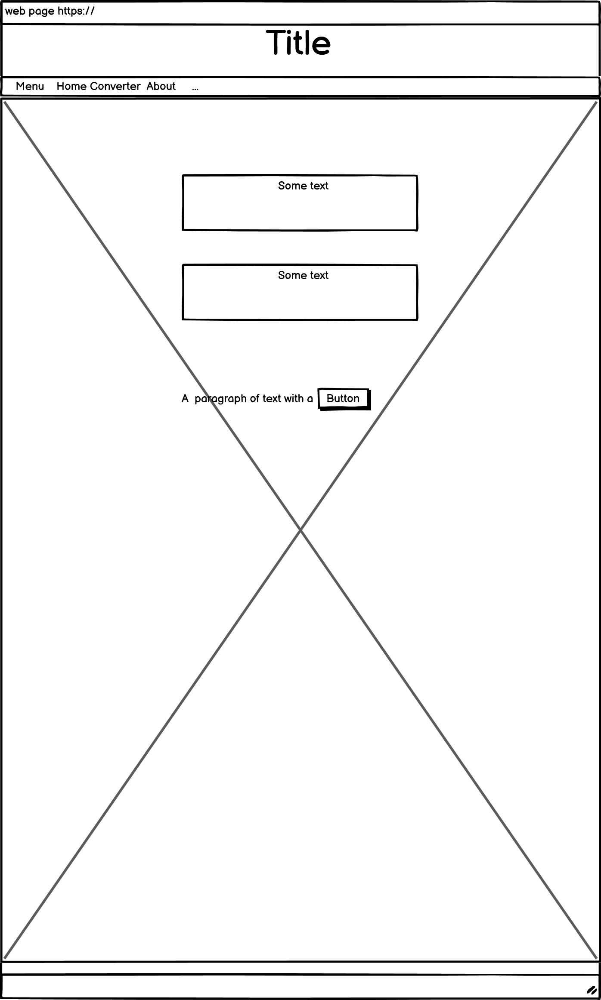
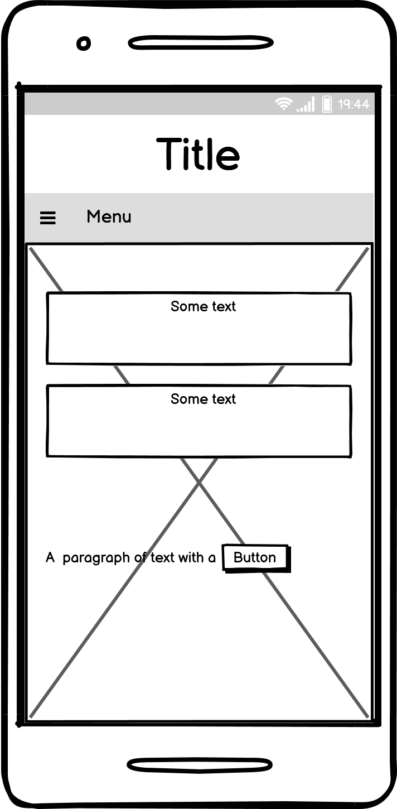
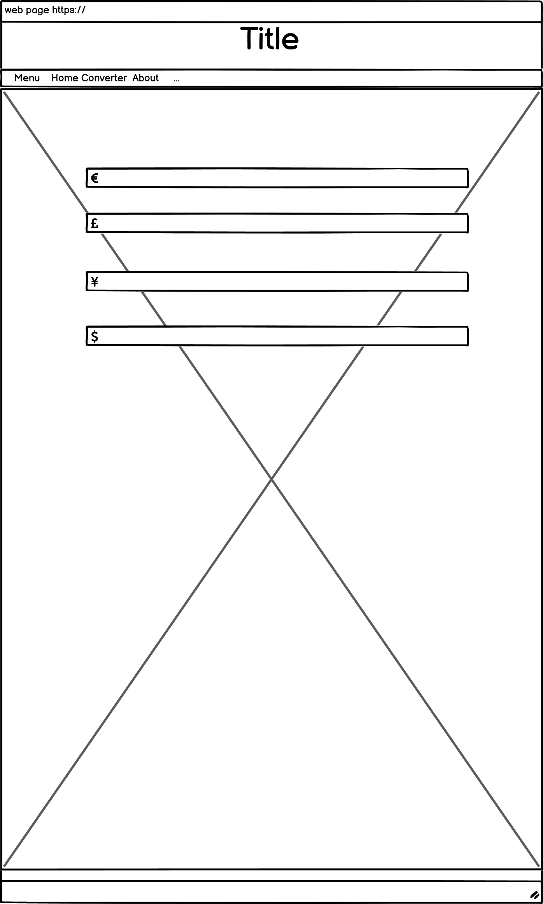
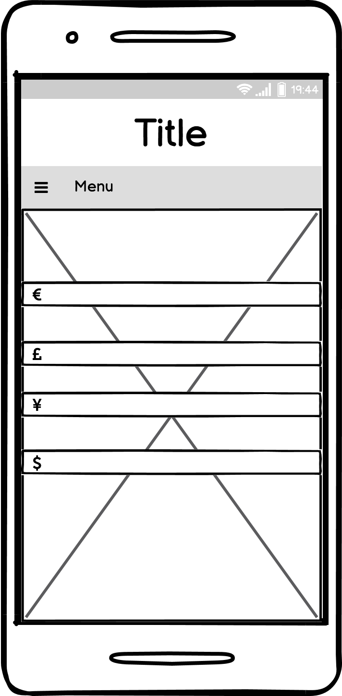
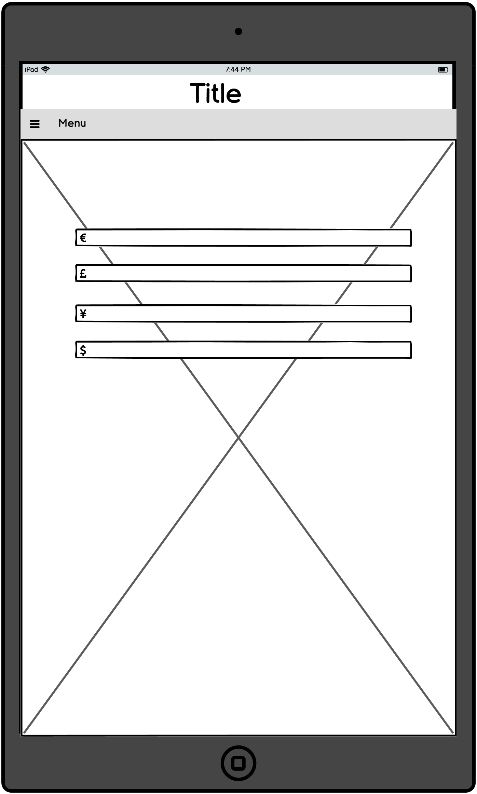
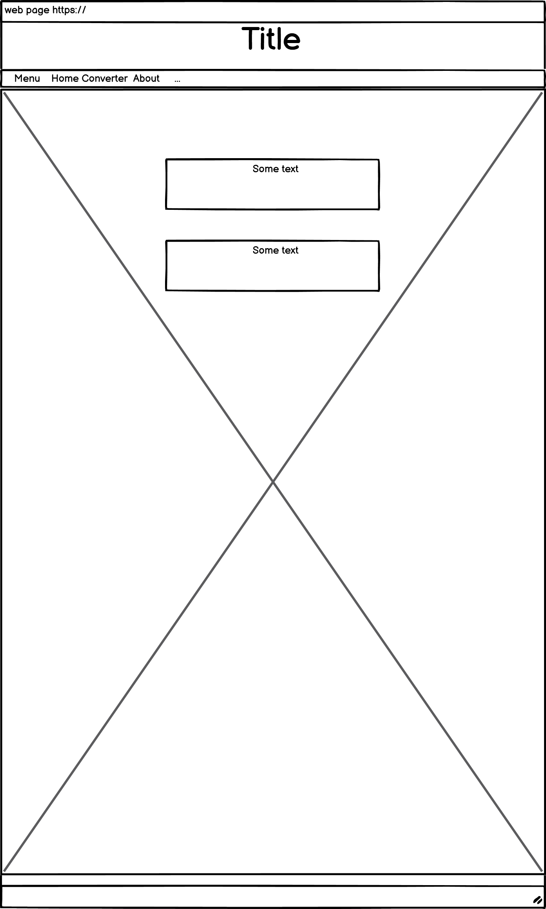
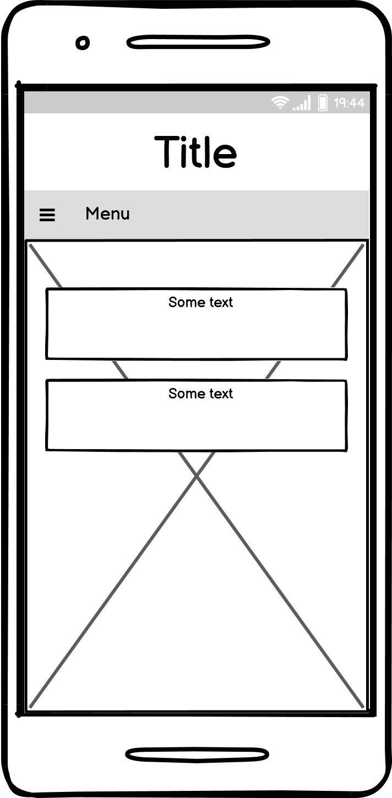
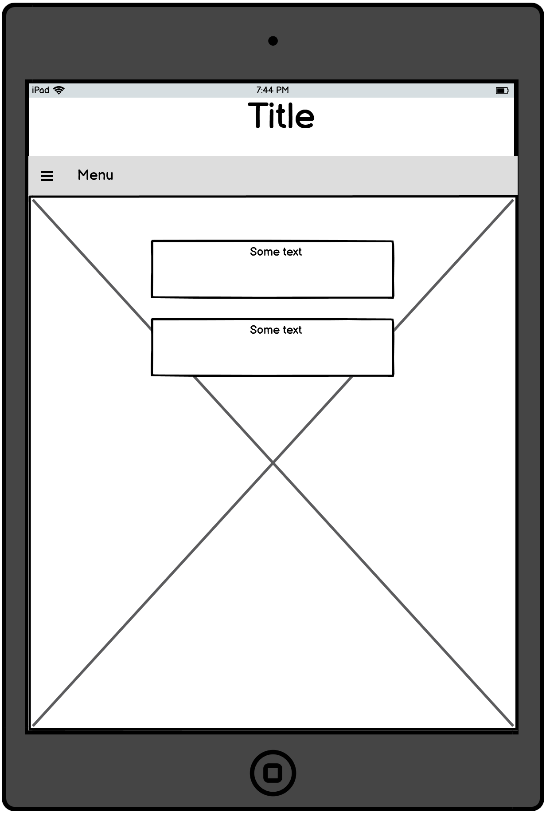

# MONEY CONVERTER

## THIS CONVERTER IS ONLY FOR EURO, USD, GBP AND YEN !!

---

# Interface

## This website is created for the purpose to inform people who would like to know the exchange rate between EURO, USD, GBP and YEN!

---

# Features

### 1. Navigation bar: 
* This allows the user to access other pages without going every time to the top and slect the pages.
* The nav bar is sticked under the title so it's easier to access by the user.
### 2. Cnverter:
*  The converter is only for four types of money :
* EURO
* GBP
* YEN
* USD
### 3. About  :
* This was created for the user to inform that the converter is not up to date and is not being updated daily.

---

# Technologies Used

For the creation of this website i used the next technologies:
* HTML/HTML5
* CSS
* BOOTSTRAP
* JAVASCRIPT

---

# Testing

In this section i would like to talk about some testing i have done with the next:

1. Navigation bar:
* Checked every menu item to verify that is changing pages.

 
2. Wireframes:
* Every page was tested in mobile form , ipad form and website form :
* Here are all the wireframes for each of page : 
 1. Home webpage :
    - 
    - 
    - 
 2. Converter webpage :
    - 
    - 
    - 
 3. About webpage :
    - 
    - 
    - 

3. HTML :
* The html has been checked with the help of 

4. CSS :
*The CSS has been checked with the help of 

 ---

# Deployment
### This website was Deployed with the help of github.

# Credits

### The background image for the project was taken from google images.
> This is the link for the image: 